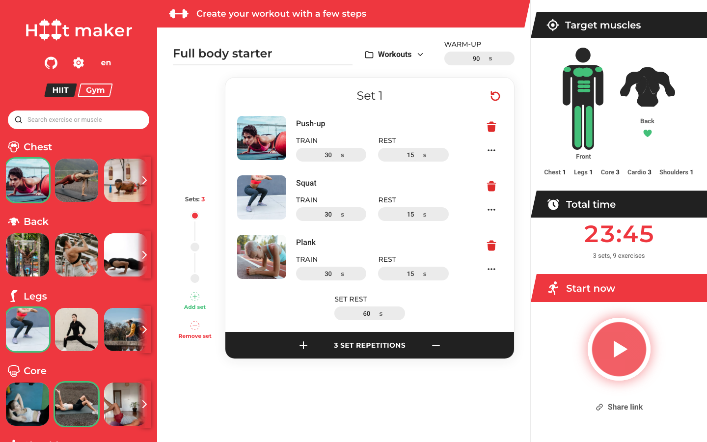
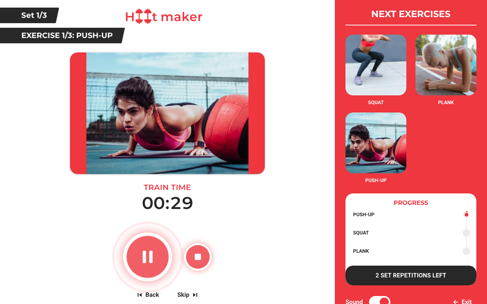

# HIIT Maker

[](https://github.com/lucasmsa/hiit-maker/actions/workflows/ci.yml)

Build interval circuits in the browser, then run them from a phone with a timer
readable from across the room. Everything stays on the device: no account, no
server, works offline once installed.

Live at https://hiit.lucasmsa.dev

## Screens





## Workouts

- Catalog of 40 bodyweight exercises across chest, back, legs, core,
  shoulders, arms and cardio, each with a photo.
- Sets with per-exercise train and rest seconds, set repetitions and rest
  between sets. No cap on sets or exercises; drag or use the keyboard to
  reorder.
- Total time and target muscles update as the workout changes.
- Run screen driven by the wall clock, so a backgrounded tab or a locked phone
  does not drift the countdown. Sound cues at 3, 2, 1 and on every phase change.
  The screen stays awake during a run.
- Share a workout as a link; opening it imports the workout.

Interface in English and Brazilian Portuguese.

## Development

```sh
pnpm install
pnpm dev
```

```sh
pnpm typecheck
pnpm lint
pnpm test
pnpm test:e2e
pnpm build
```

Node 22 and pnpm (see `packageManager` in `package.json`).

## Architecture

- Vite, React 19, TypeScript strict, Tailwind v4 over CSS-variable tokens,
  motion for animation.
- Two Zustand stores with versioned persistence: the library (workouts,
  routines, logs, settings) and the active run.
- Pure functions in `src/lib` (schedule compilation, run clock, share codec,
  editors); components render only, hooks hold behaviour.
- Installable PWA with the app shell and catalog photos precached.
- Decisions are recorded in [docs/adr](docs/adr); the visual system in
  [docs/design.md](docs/design.md).
- CI runs typecheck, lint, tests and build on `dev`, `prod` and pull requests.
  Deploys go through the Vercel Git integration.

## Credits

Exercise photos are used under the Pexels License and the muscle group icons
are Game Icons (CC BY 3.0). Sources and authors are listed in
[public/exercises/ATTRIBUTION.md](public/exercises/ATTRIBUTION.md).

## License

GPL-3.0. See [LICENSE.md](LICENSE.md).

UX/UI design of the original app by [Marcelo Alves](https://www.linkedin.com/in/marcelo-alves-gomes/).
